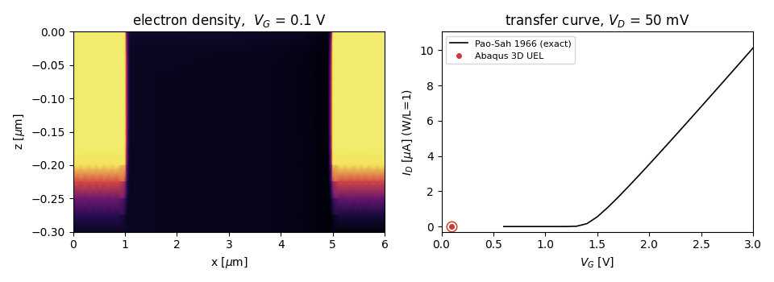
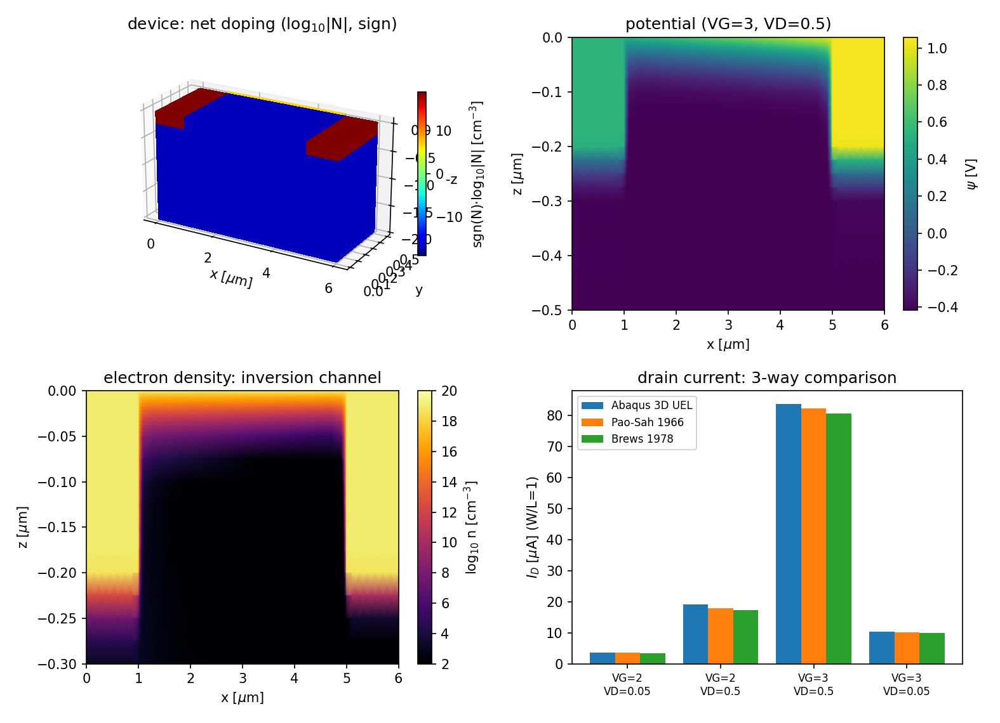
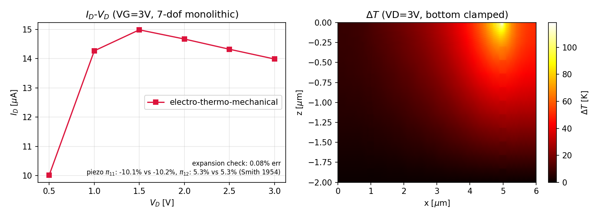
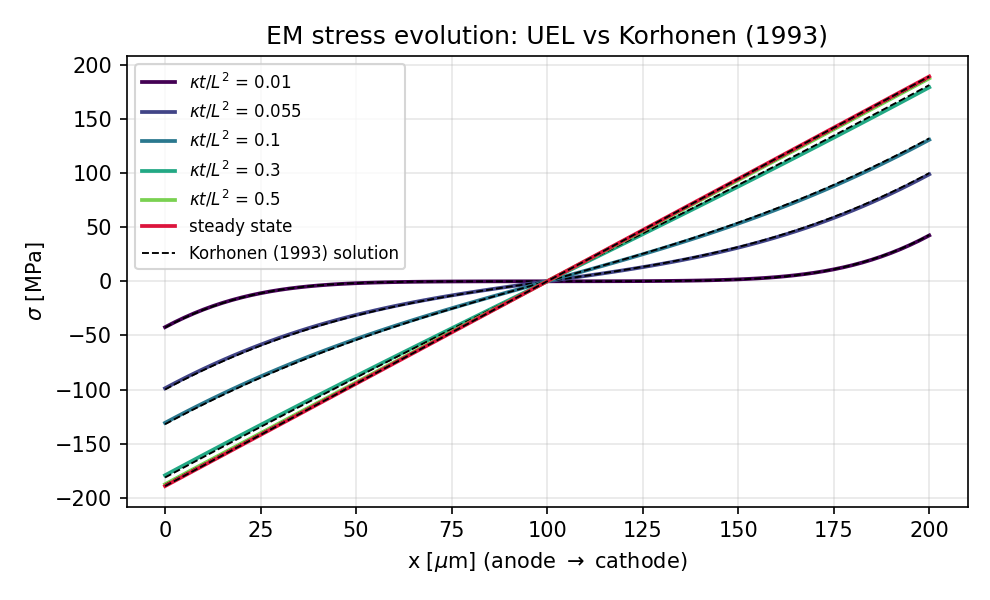

# TCAD in Abaqus — Semiconductor Device Simulation with User Elements

**Abaqus 사용자 요소(UEL)로 구현한 반도체 소자 시뮬레이션(TCAD): pn 다이오드와 3D
MOSFET의 드리프트-확산(drift–diffusion) 해석.**

Semiconductor device simulation (drift–diffusion TCAD) implemented as **Abaqus user
elements (UEL)** — the structural FE solver becomes a device simulator. Nodal degrees of
freedom are electrostatic potential and carrier densities instead of displacements; the
discretization is the same edge-based Scharfetter–Gummel box method used by real TCAD
codes (Silvaco, Sentaurus). Everything is verified against classic papers and independent
Python reference implementations.

## Demo — MOSFET turn-on, live from Abaqus

Gate-voltage sweep 0 → 3 V (V_D = 50 mV) in a single Abaqus job: the inversion
channel switches on at the surface as V_G crosses threshold (~1.3 V), and the
UEL drain current traces the Pao–Sah (1966) exact transfer curve point by point.



Reproduce with `python mosfet/make_demo.py`.



## Contents

| | model | UEL | verification |
|---|---|---|---|
| `diode/` | 1D pn junction, drift–diffusion (ψ, n, p) | 2-node element, Scharfetter–Gummel (1969) exponential-fitting flux, analytic unsymmetric Jacobian | node-wise 5×10⁻⁸ agreement with an independent Python solver; built-in potential, mass-action law, current conservation |
| `mosfet/` | 3D long-channel NMOS (6×0.5×2 µm, n⁺ 10¹⁹ S/D, p-substrate 10¹⁷, 10 nm oxide, L = 4 µm) | 8-node hex box-method element with SG fluxes on all 12 edges, quasi-Fermi variables (ψ, φₙ, φₚ) | drain current vs. Pao–Sah (1966) exact double integral and Brews (1978) charge-sheet model |
| `mosfet/` (electro-thermal) | same NMOS with **self-heating**: lattice temperature as a 4th nodal dof, steady-state heat equation with edge-lumped Joule heating, V_T(T) and µ(T) feedback (a minimal Wachutka 1990 thermodynamic model) | **monolithic** (ψ, φₙ, φₚ, ΔT) Newton — one unsymmetric 4×4-block Jacobian, not the usual staggered TCAD↔thermal loop | energy balance (heatsink reaction heat = ΣI·V, Tellegen) to 0.01 %; isothermal limit reproduces Pao–Sah; I_D–V_D droop with negative output conductance |
| `mosfet/` (electro-thermo-mechanical) | + small-strain **thermoelasticity** (trilinear hex, 2×2×2 Gauss, σ = C:(ε − αΔT·I)) and **piezoresistive** mobility feedback from the element stress (Smith 1954 n-Si coefficients) | **7-dof monolithic** (ψ, φₙ, φₚ, ΔT, uₓ, u_y, u_z) — displacements ride Abaqus dof slots 5–7 (UR2/UR3/WARP) | uniform-ΔT free expansion vs closed form (0.08 %); longitudinal/transverse ±100 MPa vs Smith's π₁₁ and π₁₂ (−10.13 vs −10.22 %, +5.32 vs +5.34 %); energy balance 0.01 %; thermal-stress droop on top of self-heating |
| `mosfet/run_resistor.py` | uniform n⁺ bar resistor on the same 7-dof element — the element-level answer key | every field has a closed form | R vs L/(q n µ A) (0.30 %); parabolic Joule self-heating profile ΔT_max = PL/8κA (0.02 %, shape ratio 0.7498 vs 0.75); energy balance 0.00 % |
| `emig/` | metal-line **electromigration** (Korhonen vacancy/stress model): ohmic V + EM stress σ, blocked ends, electron-wind drive, backward-Euler transient | 1D 2-node (V, σ) monolithic UEL | node-wise reproduction of Korhonen's (1993) published finite-line solution across κt/L² = 0.01–0.5 (worst 1.09 %); steady Blech–Herring back-stress Δσ = eZ*ρjL/Ω to 0.00 %; Blech (1976) critical product (jL)_c |

### MOSFET drain current: 3D UEL vs. the papers

| V_G [V] | V_D [V] | I_D UEL [µA] | Pao–Sah 1966 | Brews 1978 | dev (UEL/PS) |
|---|---|---|---|---|---|
| 2.0 | 0.05 | 3.61 | 3.53 | 3.41 | 2.3 % |
| 2.0 | 0.50 | 19.1 | 18.0 | 17.2 | 6.3 % |
| 3.0 | 0.50 | 83.8 | 82.4 | 80.7 | 1.7 % |
| 3.0 | 0.05 | 10.2 | 10.1 | 9.9 | 1.0 % |

The largest deviation sits at the saturation knee (V_G − V_T0 ≈ 0.7 V), exactly where the
gradual-channel assumption behind Pao–Sah starts to strain — the 2D device solution does
not make that assumption, so diverging there is correct behavior, not error.

## Self-heating MOSFET: monolithic electro-thermal UEL

Lattice temperature rise ΔT is added as a **4th nodal degree of freedom** and solved in
the *same* Newton matrix as the device equations — (ψ, φₙ, φₚ, ΔT) fully coupled. This
is the differentiator: published electro-thermal device studies overwhelmingly couple a
TCAD solver to a thermal FE solver in a staggered loop; here the whole thing is one
unsymmetric Jacobian inside Abaqus. The heat equation is discretized with the same
box method (edge conductances κA/h), the Joule source J·E is lumped edge-wise from the
SG fluxes, and temperature feeds back through V_T(T) = k_BT/q in the SG exponent and
µ(T) ∝ (T/300)⁻³ᐟ².


V_G = 3 V, substrate bottom held at 300 K, all other surfaces adiabatic. The device is a
0.5 µm-wide toy, so the physical dissipation (~µW) gives mK heating; a heat multiplier
HSCALE = 200 emulates a multi-finger power layout (equivalent to scaling κ down) to make
the classic signatures visible:

| V_D [V] | I_D isothermal [µA] | I_D self-heating [µA] | ΔT_max [K] | energy balance err |
|---|---|---|---|---|
| 0.5 | 10.5 | 10.0 | 5.8 | 0.00 % |
| 1.5 | 17.9 | 15.0 | 37.7 | 0.01 % |
| 3.0 | 18.4 | 14.0 | 118.9 | 0.00 % |

Verification (no closed form exists for the coupled problem):
- **Energy balance / Tellegen**: total heat flowing out through the heatsink (reaction
  "moment" of the ΔT dof at the Dirichlet nodes) equals HSCALE·I_D·V_D to 0.01 % — the
  discrete Joule sum over edges telescopes exactly to the terminal power.
- **Weak-coupling limit**: with HSCALE = 0 the element reduces to the isothermal UEL
  equation-for-equation; I_D matches Pao–Sah within 3.7 % (V_D ≤ 1 V, where the
  gradual-channel assumption holds) and ΔT ≡ 0 to machine precision.
- **Self-heating signature**: 23 % I_D droop at V_D = 3 V with *negative* output
  conductance beyond V_D ≈ 1.5 V, and the temperature hotspot sits at the drain end of
  the channel — the textbook qualitative picture.

Reproduce with `python mosfet/run_selfheating.py` (two Abaqus jobs, heating on/off).

### Monolithic vs. staggered: why the cross-Jacobian matters

`mosfet/run_staggered.py` re-runs the same problem with a variant element
(`uel_mos_et_stag.f`) that keeps the residual — hence the physics and the converged
solution — bit-identical, but deletes the electro↔thermal cross blocks from the
Jacobian. Each Abaqus Newton iteration then acts as one pass of an *un-relaxed*
staggered (block-Jacobi) scheme, i.e. exactly what a TCAD↔thermal-FE co-simulation
loop does per outer iteration:

| HSCALE (coupling) | monolithic | staggered-type |
|---|---|---|
| 5 | 8/8 steps, 339 iterations | diverges in the first heated step |
| 50 | 8/8, 350 | diverges |
| 200 | 8/8, 358 | diverges |
| 800 | 8/8, 363 | diverges |

The monolithic cost is essentially flat in coupling strength, while the partitioned
iteration fails at *every* tested strength — with an identical divergence signature
(a sign-alternating φₙ residual growing ~180× per iteration). The reason it does not
even survive weak heating: the electrical residual's temperature sensitivity scales
with the *current* (µ(T), V_T(T)), not with ΔT, and the weakly conducting thermal
network (κA/h down to 10⁻⁸ W/K across the thin surface layers) amplifies each stale
Joule update into a large temperature swing, so the partitioned loop gain exceeds
unity long before the temperature rise is even measurable. Production staggered
co-simulations survive this with under-relaxation and loose outer tolerances; inside
a tight Newton framework, the cross-derivative blocks are what make convergence
possible at all.

## Electro-thermo-mechanical: the full three-field loop

`mosfet/uel_mos_etm.f` extends the element to **seven nodal dofs**
(ψ, φₙ, φₚ, ΔT, uₓ, u_y, u_z), closing the loop
*current → Joule heat → temperature → thermal strain → stress → piezoresistance →
mobility → current* in a single monolithic Newton iteration. Displacements occupy
Abaqus's remaining structural dof slots (5, 6, 7 = UR2, UR3, warping — a `*STATIC`
step accepts all of them for user elements). Mechanics is standard small-strain
thermoelasticity on the same hexahedra (2×2×2 Gauss, consistent K_uu and
thermal-expansion K_uT blocks); the electron mobility carries a piezoresistance factor
1 − (π₁₁σₓₓ + π₁₂(σ_yy + σ_zz)) with Smith (1954) n-Si coefficients evaluated from the
element-center stress.



Verification (`python mosfet/run_etm.py`, three Abaqus jobs):

| check | result | reference |
|---|---|---|
| uniform ΔT = 100 K free expansion (bottom rollers) | u_z(top) error 0.08 % | closed form u_z = −αΔT·H |
| longitudinal σₓₓ = −100 MPa via face displacement | ΔI_D/I_D = −10.13 % | Smith (1954): −π₁₁σₓₓ = −10.22 % |
| transverse σ_yy = −100 MPa | ΔI_D/I_D = +5.32 % | Smith (1954): −π₁₂σ_yy = +5.34 % |
| full loop, bottom clamped, HSCALE = 200 | energy balance ≤ 0.01 %, ΔT_max 118 K | Tellegen, as above |
| thermal-stress feedback | I_D(3 V) = 13.99 µA < 14.04 µA (thermal-only) | compressive hotspot lowers µₙ — extra droop on top of self-heating |

`mosfet/run_resistor.py` adds the element-level answer key on a uniform n⁺ bar, where
*every* field has a closed form: resistance R = L/(q n µₙ A) reproduced to 0.30 %, the
parabolic Joule-heating temperature profile ΔT_max = PL/8κA to 0.02 % (quarter-point
shape ratio 0.7498 vs. the exact 0.75), and end-contact heat reactions equal to I·V to
0.00 %.

## Electromigration: Korhonen model UEL

`emig/uel_em.f` applies the same monolithic recipe to interconnect reliability: a 1D
2-node element with dofs (V, σ) solving ohmic conduction together with the
Korhonen stress-evolution equation ∂σ/∂t = ∂/∂x[κ(∂σ/∂x − eZ*ρj/Ω)] — electron-wind
drive, blocked line ends, backward-Euler in time (σ_old recovered from U − ΔU, no
state variables needed). Al parameters at accelerated-test temperature
(ρ = 4.9 µΩ·cm, Z* = 4, Ω = 1.66×10⁻²³ cm³, κ = 1.8×10⁻⁹ cm²/s).



Verification is a direct reproduction of the published results (`python emig/run_emig.py`):
the finite-line stress-evolution solution that Korhonen et al. *published* (the source of
their figures) is re-implemented independently in `emig/reference_korhonen.py` — the same
treatment Pao–Sah gets on the MOSFET side — and the UEL is compared against it node by
node across the whole evolution:

| check | result | reference |
|---|---|---|
| stress profiles at κt/L² = 0.01, 0.055, 0.1, 0.3, 0.5 | worst node-wise deviation 1.09 % of σ_ss (0.16 % at the earliest time) | Korhonen et al., J. Appl. Phys. 73 (1993) 3790, finite blocked line — the paper's published solution |
| steady-state back-stress | Δσ = 378.3 MPa vs eZ*ρjL/Ω = 378.3 MPa, linearity residual 0.00 % | Blech–Herring back-stress; tension at cathode, compression at anode |
| critical product | test jL = 2000 A/cm > (jL)_c ≈ 1260 A/cm → EM proceeds; (jL)_c maps to a 119 MPa back-stress ceiling | Blech, J. Appl. Phys. 47 (1976) 1203 (measured Al critical product) |

The piezoresistive coupling enters the residual only (its Jacobian columns are
omitted — a deliberate quasi-Newton shortcut for a ~3 % effect; the V_D continuation
ladder carries convergence, and all four checks still pass).

## How to run

Requires Abaqus (tested with 2024) with a linked Fortran compiler, plus Python 3 with
numpy (and matplotlib for the figure).

```
cd diode
python run_diode.py     # ~1 min: writes inp, runs abaqus job=... user=uel_dd.f, checks

cd mosfet
python run_mosfet.py         # ~3 min: full bias sweep in one job (6 steps), figure + checks
python run_selfheating.py    # ~4 min: electro-thermal, 2 jobs (HSCALE 0/200), figure + checks
python run_etm.py            # ~7 min: electro-thermo-mechanical, 4 jobs, figure + checks
python run_resistor.py       # ~1 min: element answer key (R, parabolic dT, energy)
python run_staggered.py      # ~25 min: monolithic vs staggered-type, 8 jobs

cd emig
python run_emig.py           # ~1 min: electromigration vs Korhonen/Blech, figure + checks
```

Each driver generates the mesh/inp, launches Abaqus, parses the `.dat` output, and
asserts the physics checks — if it prints `check passed`, everything reproduced.

## Implementation notes (the parts that bite)

- **No initial conditions in Abaqus statics** → starting from U = 0 with full doping
  charge makes Newton explode. Fix: ramp the doping with step time *inside the UEL*
  (the classic TCAD doping-continuation trick).
- **(ψ, n, p) unknowns diverge at real doping levels** (n/nᵢ ~ 10⁹). Fix: switch to
  quasi-Fermi potentials, n = nᵢ e^(ψ−φₙ), p = nᵢ e^(φₚ−ψ) — all unknowns become
  bounded voltages, and contact BCs become plain voltage ramps. Also standard practice
  in production device solvers.
- **`DEXP(T) - 1.D0` is not `expm1`**: catastrophic cancellation at |t| ~ 10⁻⁸ puts a
  10⁻⁴ floor under the Bernoulli-function fluxes. Use a series branch for small |t|.
- **Terminal current = reaction force.** At Dirichlet-constrained contact dofs, the
  Abaqus reaction (RF) of the continuity equations *is* the discrete carrier flux into
  the contact: I = q·nᵢ·ΣRF. No flux post-processing needed, and it is exactly
  conservative.
- The coupled Jacobian is unsymmetric — `UNSYMM` on the `*USER ELEMENT` line and
  `UNSYMM=YES` on every step, or convergence quietly degrades.
- **NaN passes every convergence check.** Coupling the weakly-conducting temperature
  equation to exponentials is a trap: during Newton excursions the SG fluxes ride the
  exp-clamp (~e⁸⁰), an unguarded Joule source kicks ΔT to 10¹⁸ K, the residual overflows
  — and Abaqus reports the step *converged*, because every comparison against NaN is
  false. It then sails through all steps in one iteration each and writes a `.dat` full
  of NaN with zero error messages. Guards: clamp the per-edge Joule power and drop the
  thermal-coupling Jacobian entries while fluxes are unphysical (both inactive at the
  converged solution, so consistency is preserved where it matters).

## FAQ

**Can Abaqus simulate semiconductor devices?**
Yes — a `*USER ELEMENT` is just "residual + Jacobian per element", and nothing forces
the degrees of freedom to be displacements. Here they are electrostatic potential and
quasi-Fermi potentials, the residuals are Poisson + electron/hole continuity, and
Abaqus's Newton loop, unsymmetric solver, and load stepping do the rest.

**How is the drift–diffusion equation discretized?**
With the Scharfetter–Gummel (1969) exponential-fitting flux on every mesh edge — the
same box-integration scheme used by commercial TCAD tools. It reduces to central
differencing for pure diffusion, becomes upwind automatically under strong drift, and
gives exactly zero flux at equilibrium.

**Why quasi-Fermi variables instead of carrier densities?**
With (ψ, n, p) at realistic doping (n/nᵢ ~ 10⁹) the coupled Newton diverges from any
cold start. With (ψ, φₙ, φₚ) every unknown is a bounded voltage, contacts become plain
voltage boundary conditions, and the same problem converges with ordinary ramping.

**Is this a full TCAD replacement?**
No — no recombination models, mobility models, or impact ionization; constant mobility
and Boltzmann statistics only. It is a transparent, verified reference implementation
of the numerical core: discretization, linearization, and solver.

## 한국어 소개

반도체 소자 시뮬레이션(TCAD)의 수치 코어 — 포아송 방정식과 전자/정공 연속
방정식의 드리프트-확산(drift–diffusion) 모델 — 를 구조해석 코드 Abaqus의 사용자
요소(UEL)로 구현한 프로젝트입니다. 상용 TCAD(Sentaurus, Silvaco Atlas)와 같은
Scharfetter–Gummel box method 이산화, 준페르미 퍼텐셜 변수, 완전 연성 Newton
풀이를 사용하며, 1D pn 접합 다이오드(내장전위·질량작용법칙·전류보존 검증)와
3D 긴채널 NMOS MOSFET(문턱전압, 반전 채널, 전달특성 I_D–V_G)을 Pao–Sah(1966)
정확해 및 Brews(1978) charge-sheet 모델과 정량 대조해 1–6% 수준으로
재현합니다. 유한요소 정식화·일관 선형화·사용자 서브루틴(UMAT/UEL) 개발
경험을 소자 시뮬레이션으로 확장한 작업입니다.

## References

- D. L. Scharfetter, H. K. Gummel, *Large-signal analysis of a silicon Read diode
  oscillator*, IEEE Trans. Electron Devices 16 (1969) 64.
- H. C. Pao, C. T. Sah, *Effects of diffusion current on characteristics of
  metal-oxide (insulator)-semiconductor transistors*, Solid-State Electron. 9 (1966) 927.
- J. R. Brews, *A charge-sheet model of the MOSFET*, Solid-State Electron. 21 (1978) 345.
- G. K. Wachutka, *Rigorous thermodynamic treatment of heat generation and conduction in
  semiconductor device modeling*, IEEE Trans. CAD 9 (1990) 1141.
- C. S. Smith, *Piezoresistance effect in germanium and silicon*, Phys. Rev. 94
  (1954) 42.
- M. A. Korhonen, P. Børgesen, K. N. Tu, C.-Y. Li, *Stress evolution due to
  electromigration in confined metal lines*, J. Appl. Phys. 73 (1993) 3790.
- I. A. Blech, *Electromigration in thin aluminum films on titanium nitride*,
  J. Appl. Phys. 47 (1976) 1203.

## Author

**심규장 (Gyu-Jang Sim)** — 서울대학교 재료역학연구실 ([MAMEL](https://mamel.snu.ac.kr), Seoul National University)
[github.com/vivelakorea](https://github.com/vivelakorea) · gyujang95@gmail.com

Formulation, Fortran UELs, Python reference solvers, and verification in this
repository are by the author. Background: computational solid mechanics
(crystal-plasticity FEM, UMAT/VUMAT development for anisotropic yield and
distortional hardening models) — this project applies the same FE machinery,
Newton solvers, and consistent-linearization discipline to semiconductor devices.

## License

MIT
